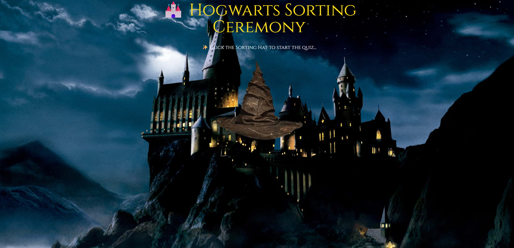
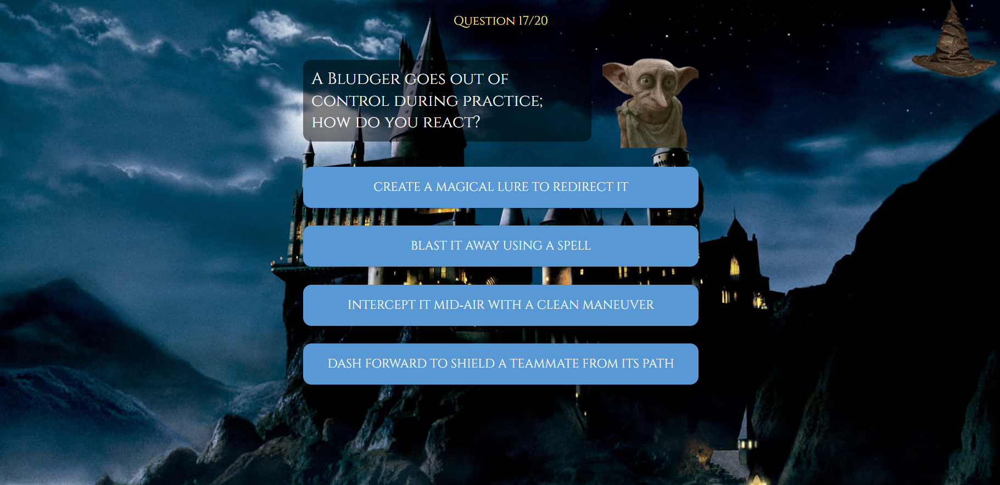
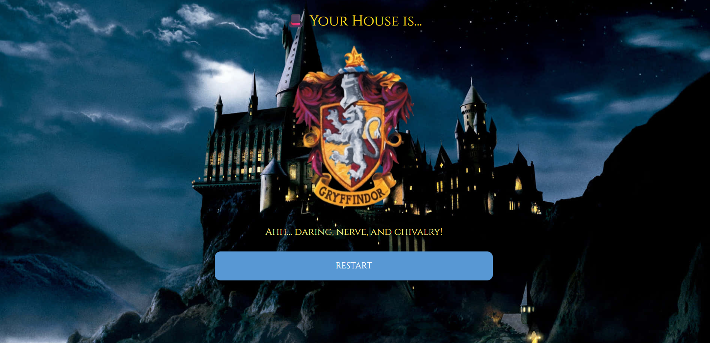

# 🧙‍♂️ Hogwarts Sorting Hat AI

✨ *"Hmm… difficult. Very difficult. Plenty of courage, I see..."*

---

## 📌 About The Project

This project is an AI-powered system inspired by the **Harry Potter universe** 🪄.

It predicts which Hogwarts house you belong to based on your personality traits using Machine Learning.

---

## Features

AI model that predicts your Hogwarts house.

Based on personality traits (Bravery, Intelligence, Loyalty, Ambition, etc.).

Interactive quiz experience.

User-friendly interface built with NiceGUI.

Magical theme with sounds & visuals.

---

## 📊 Model Details

* Model: Logistic Regression
* Input: Personality traits (scaled values)
* Output: Hogwarts House prediction
* Houses:

  * 🦁 Gryffindor
  * 🐍 Slytherin
  * 🦅 Ravenclaw
  * 🦡 Hufflepuff

---

## 📸 Screenshots

### Home Screen

### Quiz Interface

### Prediction Result

